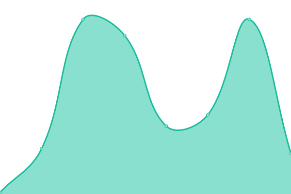
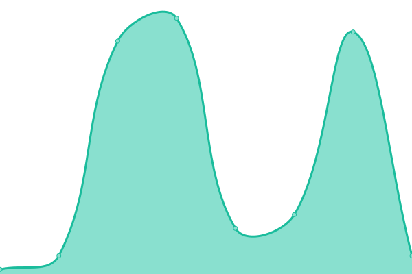
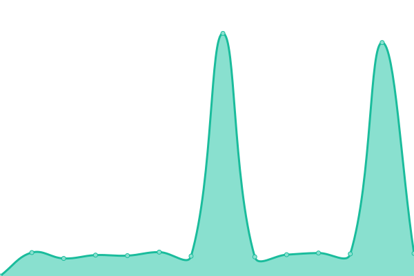

# [📈 Live Status](https://gon-alt.github.io/estado_de_sitiosWeb): <!--live status--> **🟩 All systems operational**

This repository contains the open-source uptime monitor and status page for [gon-alt](https://gon-alt.github.io/estado_de_sitiosWeb), powered by [Upptime](https://github.com/upptime/upptime).

With [Upptime](https://upptime.js.org), you can get your own unlimited and free uptime monitor and status page, powered entirely by a GitHub repository. We use [Issues](https://github.com/gon-alt/estado_de_sitiosWeb/issues) as incident reports, [Actions](https://github.com/gon-alt/estado_de_sitiosWeb/actions) as uptime monitors, and [Pages](https://gon-alt.github.io/estado_de_sitiosWeb) for the status page.

<!--start: status pages-->
<!-- This summary is generated by Upptime (https://github.com/upptime/upptime) -->
<!-- Do not edit this manually, your changes will be overwritten -->
<!-- prettier-ignore -->
| URL | Status | History | Response Time | Uptime |
| --- | ------ | ------- | ------------- | ------ |
|  [Geko](https://gon-alt.github.io/Geko/) | 🟩 Up | [geko.yml](https://github.com/gon-alt/estado_de_sitiosWeb/commits/HEAD/history/geko.yml) | 

 90ms
     
 | 

<a href="https://gon-alt.github.io/estado_de_sitiosWeb/history/geko">100.00%</a>
    

|  [Mi Sitio Web](https://gon-alt.github.io/MiSitioWeb/) | 🟩 Up | [mi-sitio-web.yml](https://github.com/gon-alt/estado_de_sitiosWeb/commits/HEAD/history/mi-sitio-web.yml) | 

 33ms
     
 | 

<a href="https://gon-alt.github.io/estado_de_sitiosWeb/history/mi-sitio-web">100.00%</a>
    

|  [Foster Viajes](https://fosterviajes.tur.ar/) | 🟩 Up | [foster-viajes.yml](https://github.com/gon-alt/estado_de_sitiosWeb/commits/HEAD/history/foster-viajes.yml) | 

 3008ms
     
 | 

<a href="https://gon-alt.github.io/estado_de_sitiosWeb/history/foster-viajes">100.00%</a>
    

<!--end: status pages-->

[**Visit our status website →**](https://gon-alt.github.io/estado_de_sitiosWeb)

## 📄 License

- Powered by: [Upptime](https://github.com/upptime/upptime)
- Code: [MIT](./LICENSE) © [gon-alt](https://gon-alt.github.io/estado_de_sitiosWeb)
- Data in the `./history` directory: [Open Database License](https://opendatacommons.org/licenses/odbl/1-0/)
